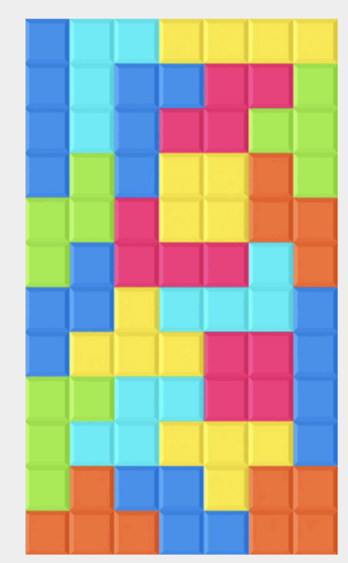

# Gridtris

Today you're going to be copying the above image, using CSS grid.

Feel free to listen to Tetris music during this one.

### Guidelines

* Use a color picker to get the colors right! A class for each color would be a good way to keep the css manageable.
* It should go without saying (but never does!) that you should not just screen grab the image. Or even the shapes. CSS, please!
* The box model works with rectangles, and while each of the seven tetris shapes is _made out of_ rectangles, only one is also one rectangle. This is going to require some alternative strategies, including some stuff that you may never have learned before. This will be a good research exercise!